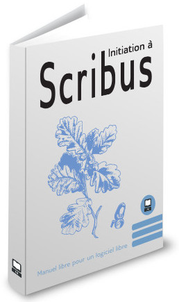

# Starting with Scribus

Repository with the translation of the french book "Initiation à Scribus" by Cédric Gémy.

- [Initiation à Scribus](content/toc-fr.md)
- [Starting with Scribus](content/toc-en.md)
- [Einführung in Scribus](content/toc-de.md)

## Contributing

---> work in progress...

You can contribute to this book by

- proofreading
- translating
- creating screenshots
- think about and propose improvements in the style, outline and content.
making pull requests or opening issues

if you want to change the content or the structure of the manual you're very welcome to propose a modification.
if you want to do the changes while doing a translation, it's ok to so. but, please, open an issue for each "important" change you do, so that it can be discussed and eventually (probably) taken over in the other languages.
