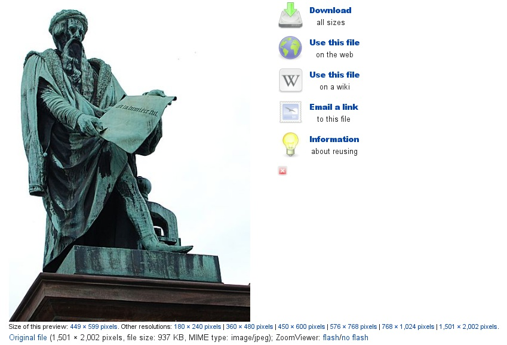
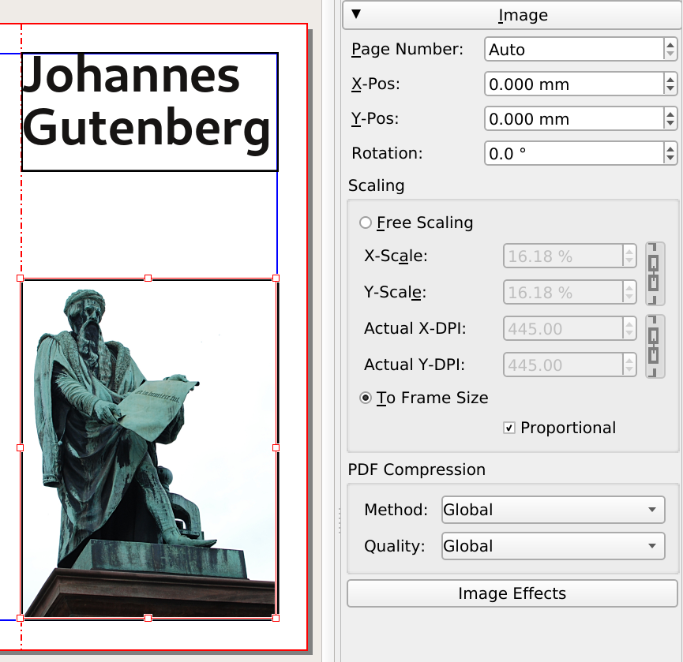

# Add an image

The next step will be to place an image of Gutenberg's statue on the cover. Download this image from Wikimedia commons:
<http://commons.wikimedia.org/wiki/File:Statue_de_Gutenberg_à_Strasbourg.jpg>

1. Make a directory "Images" inside your "Scribus-Gutenberg" directory.
2. Download the largest image available (the _original file_) and copy it to the project's "Image" directory: We will see later, that the image size matters for the finaly quality.
3. Activate the image frame tool from the menu (`Insert > Insert Image Frame`) or click the Insert Image Frame icon  from the toolbar, and then with a click-drag motion create an image frame on the cover of our brochure. 
4. Make sure you have selected the image frame, then load the photo of the statue by using _File > Import > Get Image_ (You should find the file in your "Images" directory for this project).
5. Most likely, your image appears all white: don't panic, this is the white background in the top left corner of the image! Bring up the _Windows > Properties_ palette, select the _Image_ tab, and select both options _Scale To Frame Size_ and _Proportional_.

By default, Scribus will import images according to their resolution as noted in the file. Since the statue picture does not contain that information, Scribus uses the default one: 72 dpi.

An alternative way for this operation is to right-click on the image frame and select _Adjust Image to Frame_ from the context menu.

Next, adjust the image frame by right-clicking on the frame, then choosing _Adjust Frame to Image_.

In order to fill the column with the cover of the brochure, move the frame so that it lines up with the left edge of the leaf.  
Then drag the small red square in the right lower corner of the frame, and resize the frame so that it fills the column created by the guide and the right margin.

> It is not possible to drag the image directly from the web page. They need to be downloaded to your computer.

> If you feel like you are stuck in a tool, you can always return to the arrow, either by selecting it from the toolbar or by pressing the Esc key.
