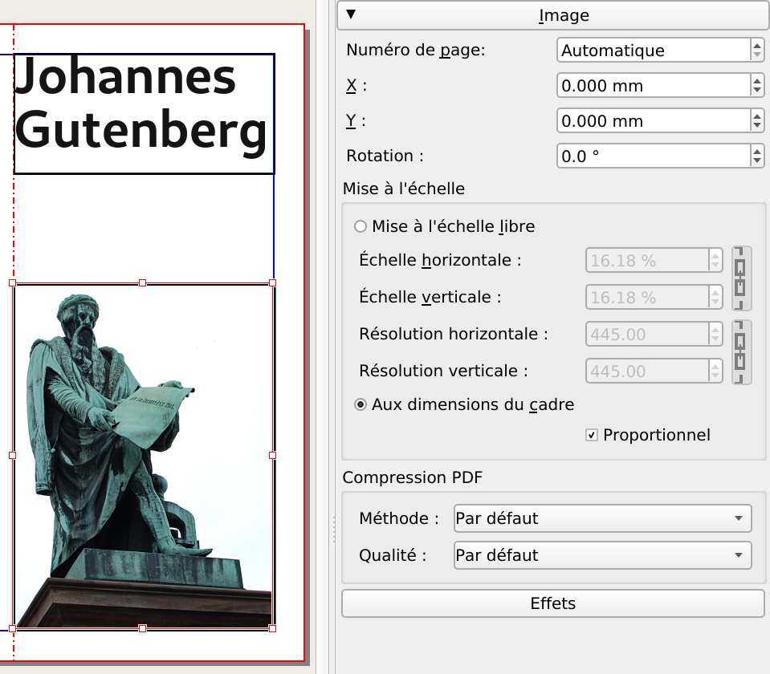

# Ajouter une image

Vous allez insérer une photo de la statue de Gutenberg dans la couverture. Téléchargez l'image de Wikimedia commons à l'adresse suivante :
<https://commons.wikimedia.org/wiki/File:Statue_de_Gutenberg_à_Strasbourg.jpg>

1. Créez un dossier « Images » dans votre dossier « Scribus-Gutenberg » ;
2. Téléchargez-y la version en résolution maximale de l'image (la plus grande taille car nous verrons ultérieurement que la taille initiale compte beaucoup dans la qualité finale).
3. Activez l'outil image par l'icône Insérer un cadre d'image dans la barre d'outil et par un cliquer-glisser dessinez un cadre d'image sur la page.
4. Assurez-vous que le cadre soit sélectionné et chargez la photo de la statue (qui se trouve dans le dossier « Images » de votre dossier de travail) en utilisant la commande `Fichier > Importer > Importer une image`.
5. Il est probable que l'image reste blanche : pas de panique, ce que vous voyez c'est l'arrière-plan blanc de la photo ! Activez la palette des propriétés (Fenêtre > Propriétés), activez l'onglet Image et activez les options Mettre l'image aux dimensions du cadre et Proportionnel si elles ne sont pas déjà cochées.

Selon sa configuration, Scribus importe en effet l'image dans la résolution définie dans le fichier image. Ne connaissant pas la qualité de reproduction dont vous aurez besoin, Scribus charge l'image dans sa taille en pixel maximale selon sa résolution interne.

Une méthode alternative plus rapide pour cette opération est de faire un clic droit sur le cadre de l'image et de sélectionner Image > Ajuster l'image au cadre.

Vous pouvez maintenant passer à l'opération suivante : recadrer la photo avec la commande Objet > Adapter le cadre à l'image, disponible également via un clic droit, et la placer sur la gauche du volet :

Par un cliquer-glisser sur le petit carré rouge dans le coin inférieur à droite, vous pouvez redimensionner le cadre pour qu'il « remplisse » la colonne.

> Il n'est pas possible de glisser directement les images depuis la page internet. Elles doivent nécessairement être enregistrées sur votre ordinateur.

> Si vous avez l'impression d'être bloqué dans un outil, vous pouvez toujours revenir à la flèche, soit en la sélectionnant dans la barre d'outils, soit en appuyant sur la touche Échap (ou Esc).
