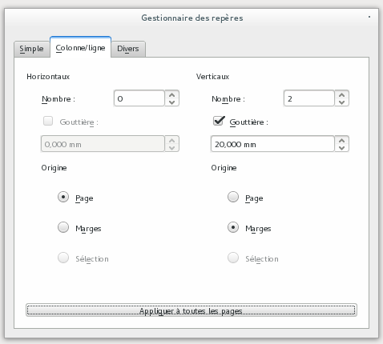
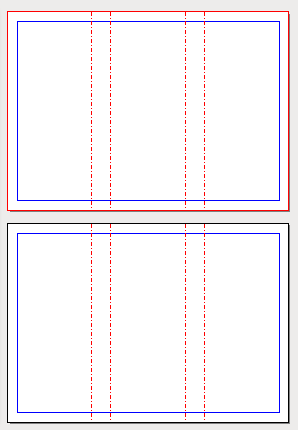

## Define the guides

Defining guides will be helpful for reproducing the folds in the layout. This will make them visible and help you better place the various elements of the layout.

In the Page menu select _Guide Management_;

1. In the second tab _Column/Row_, define two vertical guides;
2. Add a 2 cm space between the columns (the gutter). The value of the gutter is twice the margin of the document, so as to have balanced margins in the flaps.
3. You need to make the guides refer to the margins, not the page, in order to get three balanced columns.
4. Finally, click on _Apply to all pages_ and close the _Guides Manager_.
5. Make sure that in the menus the options _Page > Snap to Guides_ and _View > Grids and Guides > Show Guides_ are checked. This will make the positioning of the frames much easier.

