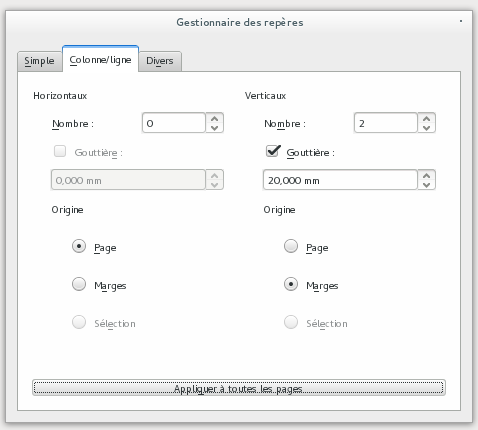
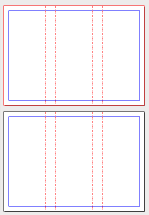
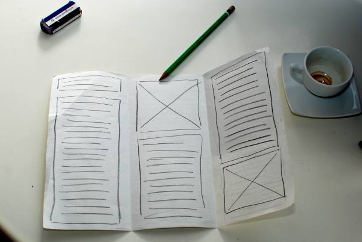

# Définir les repères

Vous allez utiliser des repères pour vous aider à reproduire les plis dans la mise en page. Cela permettra de mieux les visualiser et de vous aider à mieux positionner les différents éléments de la mise en page.

Dans le menu Page lancez la _Gestion des repères_;

1. Dans le deuxième onglet _Colonne/ligne_, définissez deux repères verticaux;
2. Ajoutez un espace entre les colonnes (la gouttière) de 2 cm. La valeur de la gouttière est le double de la marge du document, de façon à avoir des marges équilibrées dans les volets.
3. Il vous faudra encore définir que l'origine des colonnes est calculée par rapport aux marges du document et non pas de la page. Cela permet d'éviter les disproportions et d'arriver à un centrage de fait ;
4. Enfin, cliquer sur Appliquer à toutes les pages et fermez le gestionnaire des repères.
5. Finalement, assurez-vous que dans les menus les options _Page > Repères magnétiques_ et _Affichage > Grilles et Repères > Afficher les repères_ soient activées. Cela facilitera les positionnement des cadres.

