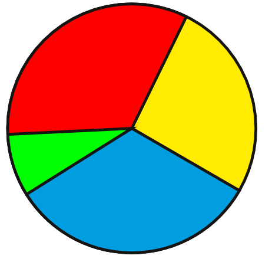

# The Drawing Tools

The _Line_  tool, allows you to draw straight lines:

1. Select the Line  tool by clicking on its icon.
2. Click on an empty space in the page and keep the left mouse button pressed.
3. Move your mouse while keeping the button pressed, and define the direction and length of the line.
4. Release the mouse when the line is the way you want it.

You can change the appearance of the line, with the Line tab of the Properties window. Later, we will see more about it.

If you want to draw a straight line, press the Ctrl key while drawing the line.

With the _Pencil_  you can draw free lines that follow the mouse.

The _Bézier_  tool allows you to draw free geometric shapes with curves or straight lines. It takes a little time to get used to it, but it is a very powerful tool.

Geometric shapes can brighten up the layout with decorative areas. If you avoid that the page becomes a patchwork of various shapes, having some choice allows to give a character to a document, by using one or two recurrent shapes in a well-dosed and non-overstated way.

The first shapes tool  gives access to a list of predefined shapes.

The second one  allows the definition of a customized polygon. First, you define its properties, then you add it to the page.

The _Arc_  can be used to draw circles or pie charts. First you draw the shape on the page, then you can modify it with the round handles. The _Edit Arc_ window can be used to specify exact values.

The _Spiral_ tool  is often of limited use, but it exists because of the difficulty of making such a form when it is needed.
