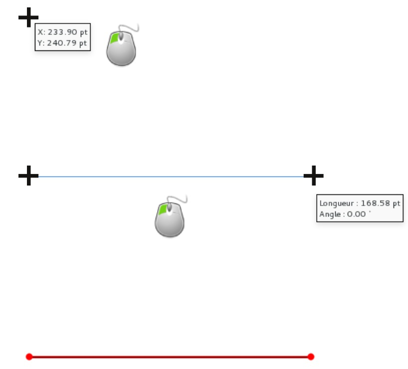
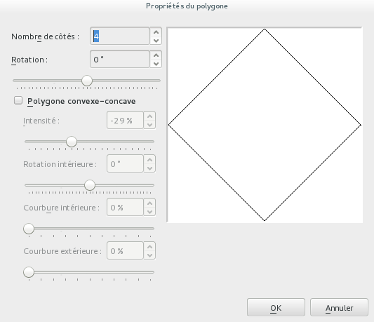
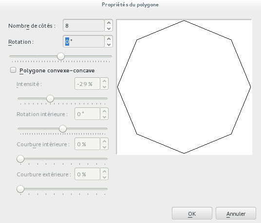
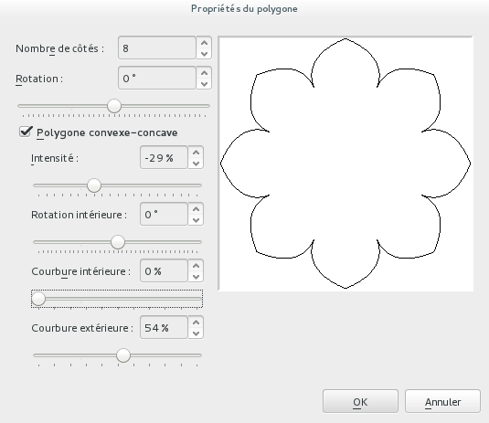
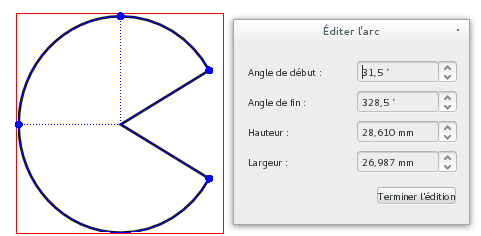
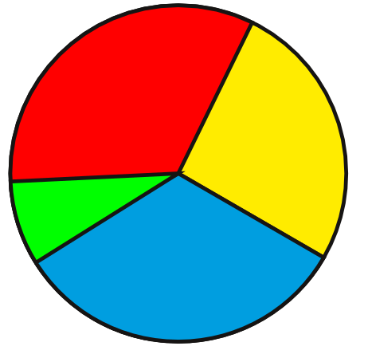

# Outils de dessin

L'outil _Ligne_ , permet de tracer des traits droits :

1. Sélectionnez l'outil Ligne en cliquant sur son icône.
2. Cliquez dans un espace vide de la page et gardez le bouton gauche de la souris enfoncé.
3. Déplacez votre souris en continuant d'appuyer, et définissez ainsi l'orientation et la longueur de la ligne.
4. Relâchez la souris lorsque le trait vous convient.

Pour modifier l'aspect de la ligne, il faudra utiliser l'onglet Filet de la fenêtre Propriétés. Nous y passerons plus loin.

Si vous souhaitez tracer un trait bien droit, appuyez sur la touche Ctrl lors du tracé de la ligne.

Le _Crayon_  permet de dessiner des formes libres qui suivent la souris.

L'outil _Bézier_  permet de dessiner des formes géométriques libres comportant des courbes ou des droites, mais sa prise en main demande un peu de temps. C'est cependant un outil très performant qui ravi tous ceux qui le connaissent.

Les diverses formes géométriques permettent d'égayer la mise en page avec des zones décoratives. Si on évitera que la page devienne un patchwork de formes variées, il est pratique d'avoir le choix pour donner du caractère à un document en faisant un usage bien dosé et non exagéré d'une ou deux formes récurrentes.

Le premier  donne accès à une liste de formes prédéfinies.

Le second  permet de personnaliser un polygone. On définira d'abord ses caractéristiques à l'aide de propriétés, puis on l'ajoutera à la page.

L'_Arc_  permet de dessiner des cercle ou des "camemberts". On tracera d'abord la forme sur la page, puis on utilisera les poignées rondes pour modifier le secteur. La fenêtre Éditer l'arc permet de spécifier des valeurs précises.

Les outils _Spirale_  trouve en général moins d'utilité, mais se justifie par la difficulté de réaliser une telle forme en cas de besoin.
