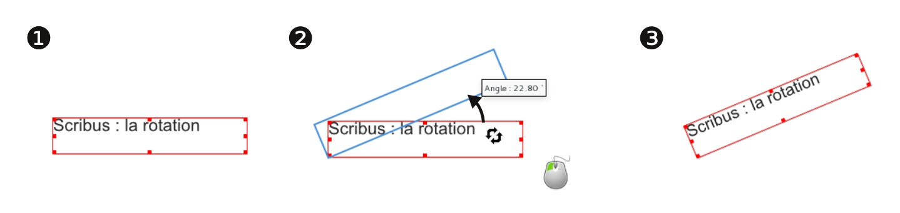
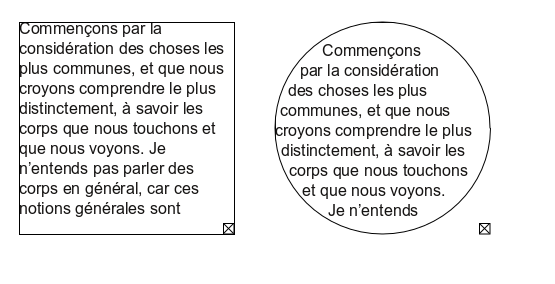

# Modify the frames

The Rotation tool , allows you to rotate a frame.  
Be aware that the content of the frame is rotated as well.

By default, Text frames are rectangular (just like the Image frames). To modify their shape, you can use the Shape settings in the Shape tab of the Properties window.

