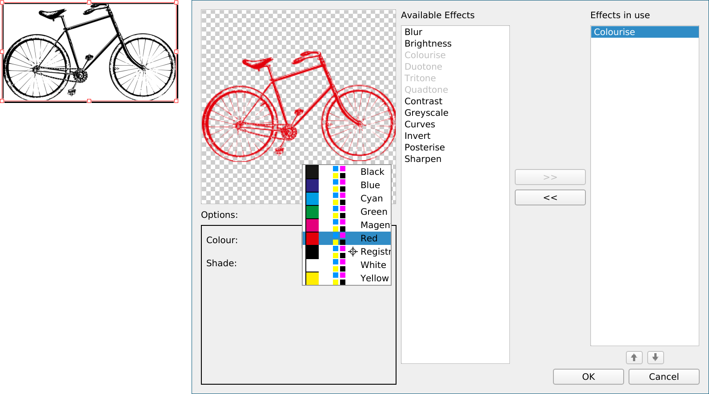
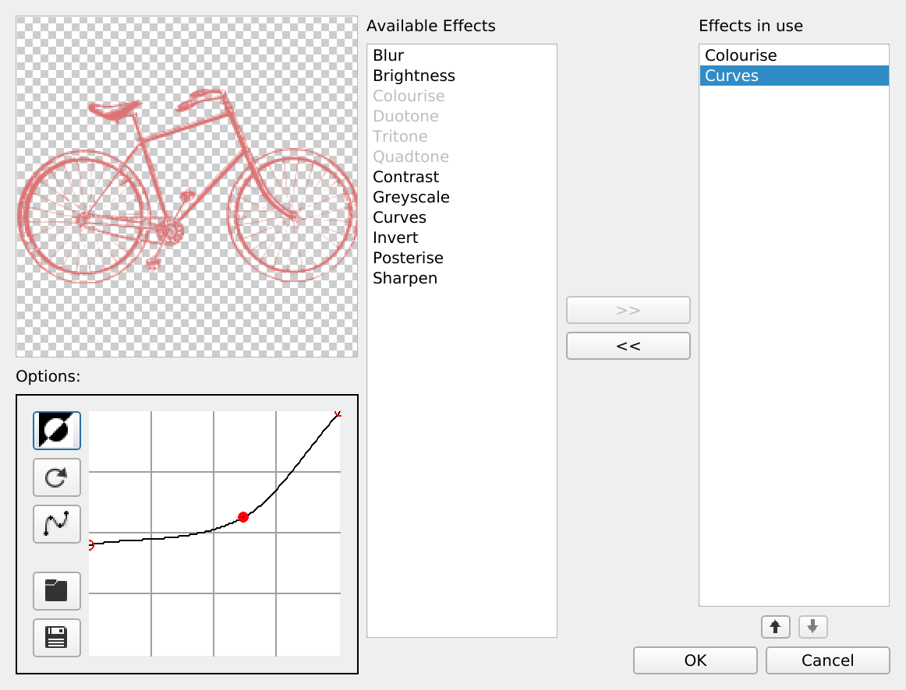

# Image effects

Scribus provides a set tools for manipulating images to help us save time and improve the final layout. Of course, photo editing software have better ergonomics and can give better results, but Scribus can be used for quick tweaks on your images.

1. At the bottom of the "Image" tab in the "Properties" palette, click on the "Image Effects" button and open the Effects tool.
2. Select one of the effects listed in the left column...
3. Click on the ">>" button to add it to the right column listing the effects that are active for the selected image.
4. On the left, a list of parameters will be displayed below the preview: you can adjust them to configure the effect.
5. When you are happy with the effect, you can add an additional one in the same way or close the window by clicking on the button "Ok".

Each effect has its specific settings that you first need to familiarize yourself with.

> For an optimal result, it is often better to edit your images with Gimp or Krita. You should also be aware that print shops often automatically apply adjustments when printing your documents: talk about it with your printer!

