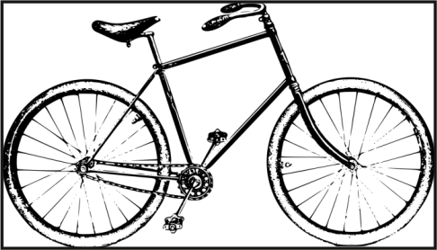
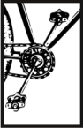
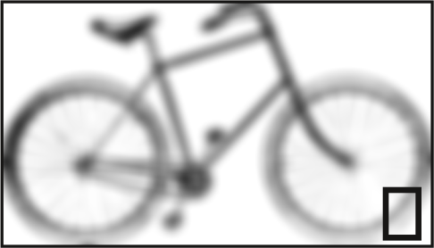

# Image position in the frame

When the image is set to _Free scaling_ it is possible to _move_ the image inside of the frame. You simply need to double click on the image and enter the edit mode.

Here the frame is larger than the image, it has a white background and a shadow.

Here the frame is smaller than the image and it's easy to select only a part of it.

Quality loss due to too low a resolution as indicated by the black rectangle.
