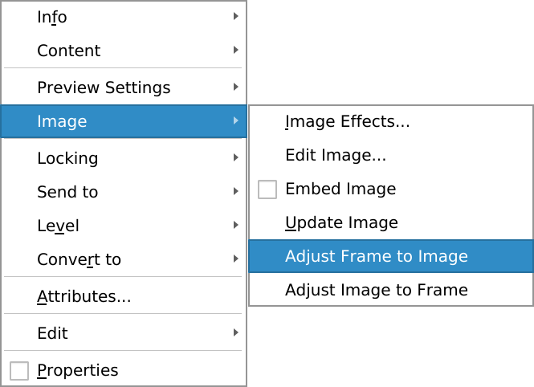
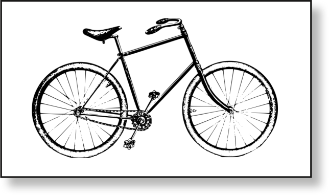

# Image position in the frame

Most of the time, you will want the frame to perfectly fit the image:

When the image is set to _Free scaling_ it is possible to _move_ the image inside of the frame. You simply need to double click on the image and enter the edit mode.

Here, the frame is larger than the image, it has a white background and a shadow.

Here, the frame is smaller than the image and it's easy to select only a part of it.
