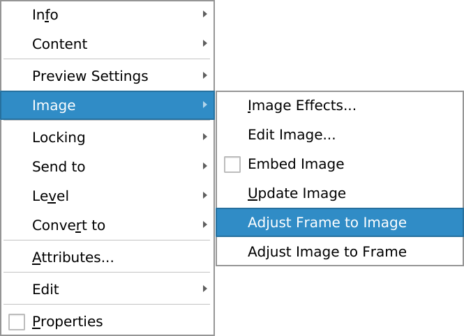

# Placement de l'Image dans le cadre

La plupart du temps, vous voudrez que le cadre soit parfaitement adapté à l'image.

Lorsque l'image est en mise à l'échelle libre il est possible de _déplacer_ l'image dans le cadre. Il faut juste un double clique sur l'image pour entrer dans le mode édition.

Ici le cadre est plus grand que l'image, il a un fond blanc en une ombre.

Ici le cadre est plus petit que l'image et permet de n'en sélectionner qu'une partie avec peu d'effort.
