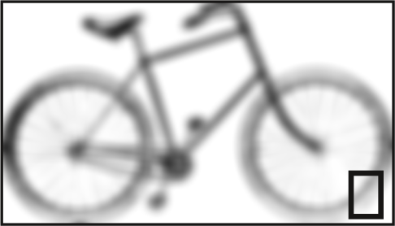

# Images, frame size and resolution

When an image is imported into Scribus, there are two possible behaviors:

- the image is imported and displayed at its own size,
- the image is stretched to fit the size of the frame

Depending on your habits and the type of document, you might have carefully prepared your picture in a a photo editing software before importing them into Scribus. More often than not, you will have time constraints and prefer to tweak the image in Scribus.

If you have already prepared the picture, with the right size and resolution, you can import it by dragging it onto the page and Scribus will create a new frame that is just fitting.

In all other cases, you will probably want to go for one of the two following solutions:

- Go to the image properties, make sure that the box _At the dimensions of the image_ is checked, and decrease the size of the image frame until the resolution is big enough (144 dpi is the minimum for the professional printing).
- Or use _Free Scaling_, with proportions kept (the _chain_ is active) and reduce the scale of the image; until you get size you need, while keeping an eye on the resolution. Finally, fit the frame to the content.

It's necessary to pay so much attention to the resolution because images can look good on screen but fail at meeting the required quality for print.  
That's why Scribus adds a black rectangle in the lower right corner, when it detects a frame with a too low resolution. 

Quality loss due to too low a resolution as indicated by the black rectangle.
