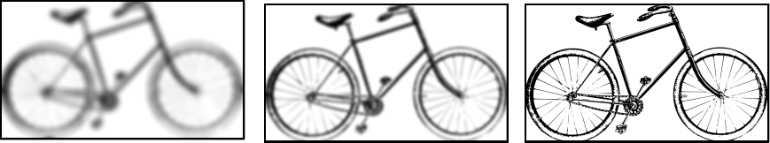
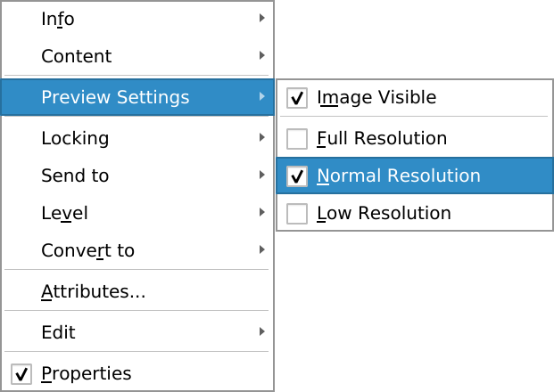

# The quality of photos

Scribus cannot substantially improve the quality of a picture. The _Item > Image > Image Effects_ window can help with some lighting problems or to create a mood, but when printing, it's the resolution that matters.

High resolution images (300dpi) can be quite heavy, since they carry more details for a given size.

High-resolution images are not only heavy to print, but are also slow to display and make Scribus less responsive. To prevent a slowdown, Scribus displays the images in reduced quality. As a result, some users are sometimes surprised to see that many images do not look sharp in Scribus.

This " degradation " only affects the display in Scribus itself: when exporting to PDF, Scribus will use the image in the highest possible quality. When you want to check the real quality of the image, simply right-click on the image and choose Preview Settings > Full Resolution.

Preview of the same image with the settings "Low resolution", "Normal resolution" and "Full resolution".
