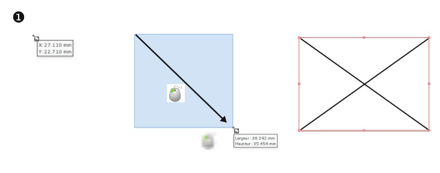
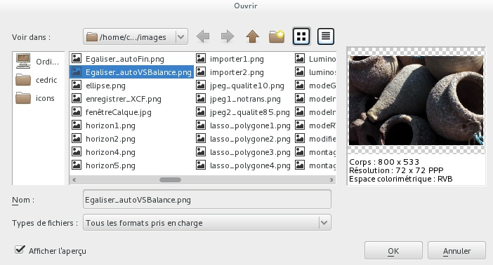
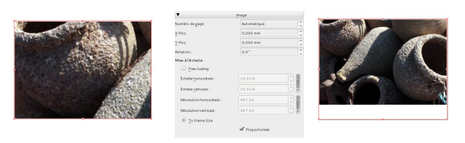

# Importing images

To insert (or rather import) images into a page, you first need to create image frames. In each image frame, you can then place one single image.

Here's how to do it:

1. Select the _Image frame_ tool  (I) and draw a frame.
2. Click with the right mouse button on the frame and choose _Content > Get Image_ or use the _Ctrl+I_ shortcut.
3. In your directories, choose the image to import and then confirm the choice with the _Ok_ button.
4. If your image is too large, open the _Window > Properties_ window (F2), activate the _Image_ tab and check the buttons _To Frame Size_ and _Proportional_.

> Scribus stores the original location of the image: it is important not to move or delete the images on your hard disk.  We recommend to create a dedicated directory where you put your images and not touch them anymore.

Depending on your setup, it may be possible to import the image by dragging it directly from its directory to its destination frame or to the page.

> Frames are required for all bitmap formats:
> JPEG, PNG, TIFF, XCF, PSD
> For PDF and EPS you can use a frame or not, depending if you want them to be inserted as bitmap or as vector.
> SVG files can only be imported as vector (and not in a frame).

