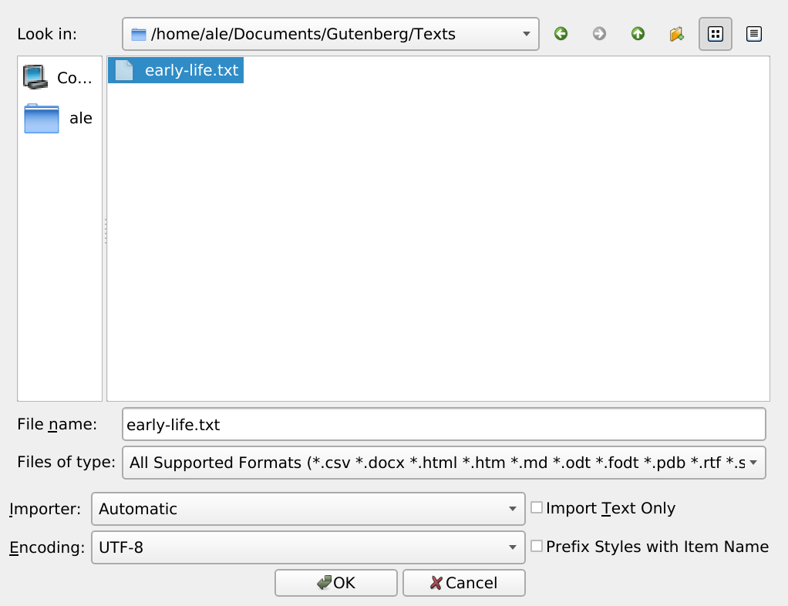
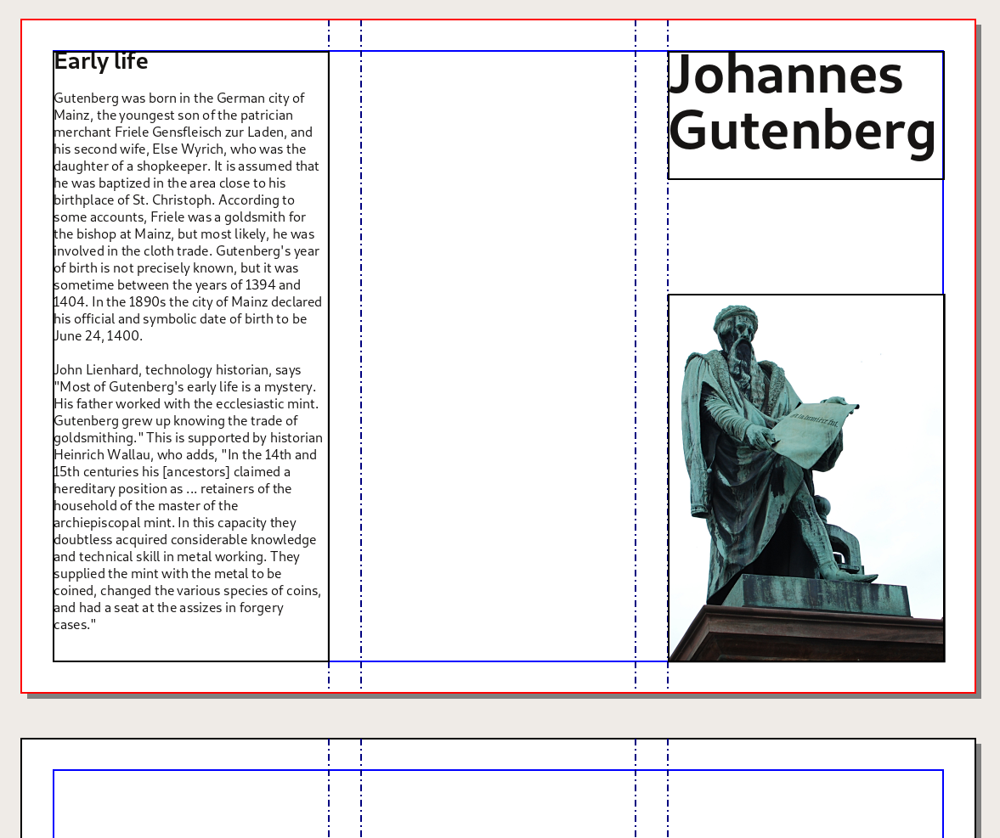
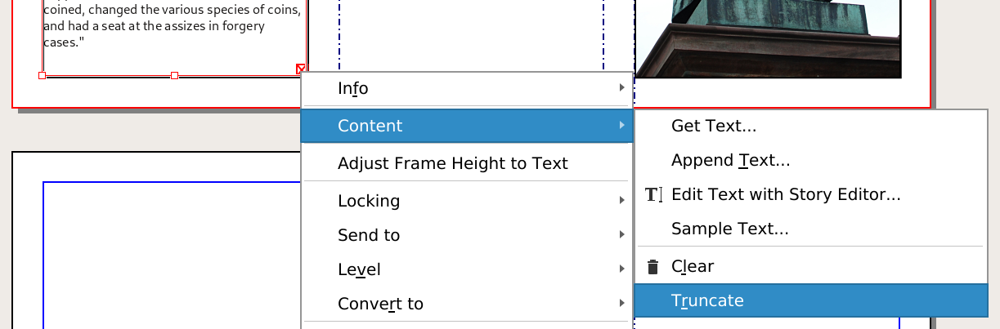

# Import some text

As you will learn in this manual, Scribus is good for layouts, but not best suited for composing text. On top of it, very often, you will be importing text written by others, or reusing text you have previewsly written in a word processor.

To simulate this situation, we will use a browser to copy "Early Life" of the the Wikipedia page about Gutenberg:  

<https://en.wikipedia.org/wiki/Johannes_Gutenberg#Early_life>

Open a [text editor](glossary-en.md#text-editor) (or a word processor), crate a new file, paste the text from Wikipedia and Save the file as a "Text File"  in a new "Text" directory inside of your working directory.

Create a text frame in the Inside flap – the left column –, resizing to fill the space between the left margin and the guide.

Select the frame, then from the menu, `File > Import > Get Text` import the text from the text file you just created.

Follow the instructions from the previous chapter [Write some text](write-text-en.md) to adjust the size of the title of this text frame.

> The red crossed box  in the lower right corner of the frame reveal that the is too long to fit in the frame. You can delete the overflowing text by right clicking on the frame and choosing _Content > Truncate_.

