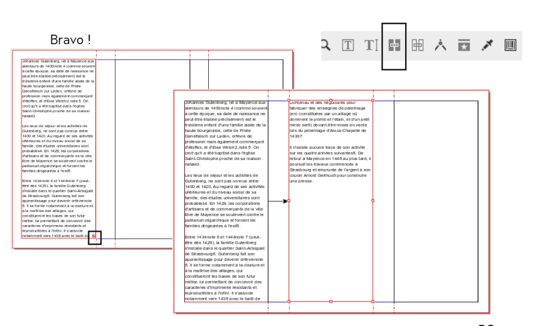

# Linking text frames

On the second page of your document, you are going to add some text which links across the three panels.

First let's learn a little trick: after you activate the text frame tool , hold down the `Shift` key while you click inside the space between the left margin and the first guide. The new text frame fills the column delimited by the margins and the guide. If you have trouble with this, you can simply create a text frame and enlarge it to the desired size. The guides will assist you in defining the correct size.

When you do a layout, you may not have all the texts yet. In this case you can insert a temporary dummy text: select the frame in the first panel,  then _Insert > Sample Text_ and choose the option Standard Lorem Ipsum.  
We add a dummy text to the text frame in the first column of the second page.

In the lower right hand corner of the text frame you see a small red box with a cross , indicating that the text is overflowing the frame.

After, having created a text frame in the second column, make sure the first frame is selected, activate the _Link Text Frames_ tool , then click the second frame. The text will flow from the first to the second frame.

For the third frame, we will learn one more little trick: click on the overflow mark  to activate the link tool and shift-click on the empty third column to create the new linked text frame.

