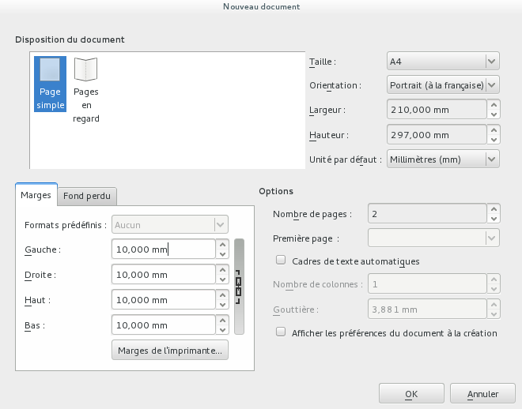
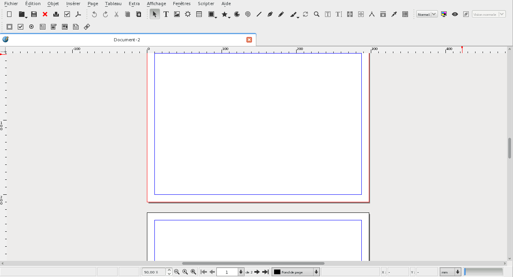

## Create a new document

When you start up Scribus, it presents you with a dialog for creating a new document. In case you may have closed this dialog, you can bring it up again with the menu _File > New._

The document you are going to create will have the following characteristics:

1. The type of display is _Single Page._
2. The size is _A4._
3. Orientation is _Landscape._
4. Make sure the units are _millimeters_ (or _inches_ for last Imperial countries).
5. Create _2_ pages, one for each side of our A4 sheet.
6. Set the margins to _1cm_ (or _10mm_) to make sure we remain within the technical boundaries of all printers.

Other parameters should stay at their default values.

Click on OK to create the document.

Here you see, how your document appears in the main window:

1. On top the menues
2. Then the toolbar (refer to [Tools](tools-en.md) for the details);
3. The rulers surrounding the page at the top and on the left;
4. At the bottom, the status bar, mostly with status information.

Now, it is the time to save your work. Create a directory _Scribus-Gutenberg_ inside your _Documents_ directory, then save the document as _gutenberg.sla_ (use _File > Save_)
