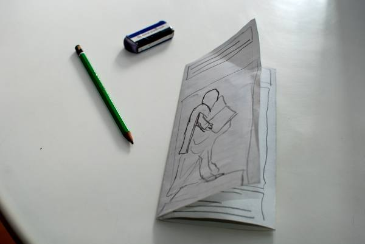
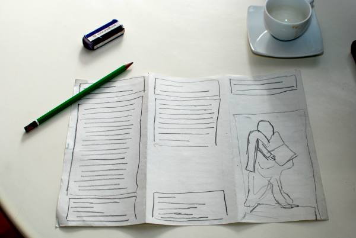
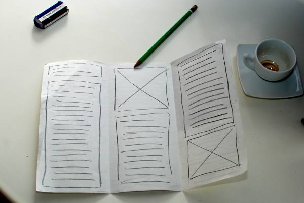

# Esquisser le document

La première étape se passe avec l'ordinateur éteint : en effet, un travail de mise en page se termine le plus souvent avec un résultat sur papier mais il commence aussi par un travail de préparation sur papier.

Pour esquisser votre dépliant prenez une feuille de papier blanc bureautique (format A4) et pliez là en trois, de façon à obtenir trois volets. Lors de la mise en page vous allez devoir vous assurer que le dernier feuillet (le rabat, volet le plus à gauche) soit légèrement moins large que les autres afin de pouvoir le plier sous celui tout à droite, qui sert de couverture (par souci de simplicité, dans cette introduction nous allons ignorer cette exigence).

Essayez d'esquisser une image sur le volet de droite et regardez le résultat :

Quelques remarques

- Au début, n'hésitez pas à faire de nombreux brouillons, même avec des bouts de papier pour tester le fonctionnement des plis.  Il existe en effet plusieurs façons de plier, et l'ordre de lecture, et donc de mise en page peut varier selon les cas.
- Travaillez avec un crayon à papier et une gomme : c'est un brouillon, pas une œuvre d'art, ça doit être rapide pour être utile !
- N'hésitez pas à recommencer à zéro.

Une fois que vous avez compris le fonctionnement des plis, vous pouvez commencer à réfléchir à la façon dont vous allez distribuer le contenu dans les volets.

En règle générale, il est conseillé d'utiliser les trois volets à l'intérieur du dépliant pour le contenu principal ; ces volets peuvent être mis en page comme trois pages successives.

Pour les trois autres volets (ceux à l’extérieur), c'est leur position lorsque le dépliant est fermé qui influence le type de contenu qui s'y adapte le mieux :

- Le volet de droite est la couverture et va contenir une grande image, un titre et une très brève explication du contenu.
- Le volet du milieu est le verso du dépliant : le plus souvent il sera utilisé pour les informations de contact.
- Le volet de gauche est la première chose que le lecteur voit en ouvrant le dépliant : il devrait contenir un résumé du contenu, ou une information transversale au contenu.

Dans les images ci-dessous vous voyez que nous avons dessiné des
cadres pour marquer l'emplacement du texte et des images :

Nous avons dessiné des lignes dans les cadres texte. Vous pouvez aussi y écrire par dessus le type de contenu que vous souhaitez y placer.

Les cadres pour les images contiennent une croix ou, dans le cas où nous avons estimé important une esquisse de l'image.

Pour cette visite guidée de Scribus nous vous proposons de créer un dépliant sur Gutenberg et les premiers pas qui ont conduit à la découverte de l'imprimerie. Nous allons utiliser des [images et du texte de Wikipédia](https://fr.wikipedia.org/wiki/Johannes_Gutenberg) sous licence  [Creative Commons Attribution – Partage dans le mêmes conditions](https://creativecommons.org/licenses/by-sa/4.0/)

<https://fr.wikipedia.org/wiki/Johannes_Gutenberg>
