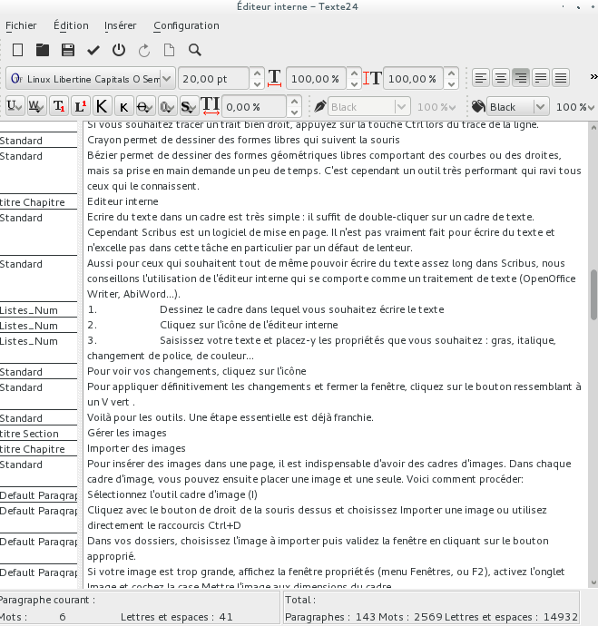

# Der Story Editor

Es ist sehr einfach, Text in einen Rahmen zu schreiben: auf einen Textrahmen doppelklicken und tippen. Scribus ist jedoch eine Layout-Software. Es ist nicht wirklich dafür gedacht, längere Texte zu verfassen und kann in gewissen Fällen sich träge anfühlen. Darüber hinaus ist es nicht immer sinnvoll, bei der Textbearbeitung auf das gesamte Layout zuzugreifen.

Für diejenigen, die längere Texte in Scribus schreiben möchten, ohne einen Textverarbeitungsprogramm zu verwenden, bietet Scribus den Story Editor.

1. Zeichne den Rahmen, in den du den Text schreiben möchtest.
2. Klicke auf das _Story Editor_ Symbol .
3. Gib den Text ein und formatiere ihn: Formatvorlage, Fett, Kursiv, Schriftarten, Farben...

Um die Änderungen zu übernehmen, klicke auf das  Symbol.

Um die Änderungen dauerhaft zu übernehmen und das Fenster zu schließen, klicke auf .

Zurück zum Layout, werden die Änderungen angezeigt.

So wird der Text im internen Editor dargestellt.

Beachte die nützlichen Statistikinformationen am unteren Rand des Fensters.
