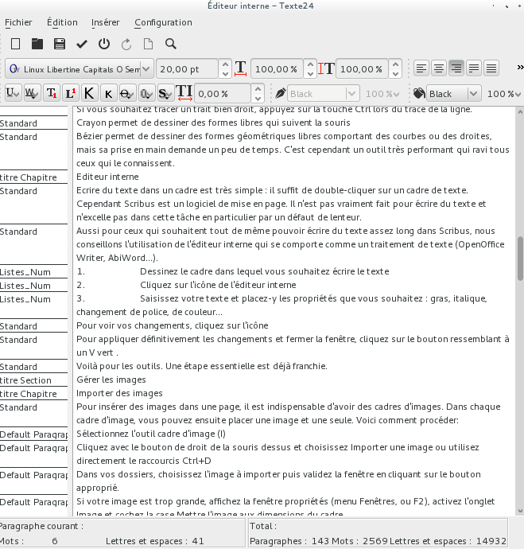

# L'éditeur interne

Écrire du texte dans un cadre est très simple : il suffit de double-cliquer sur un cadre de texte. Cependant Scribus est un logiciel de mise en page. Il n'est pas vraiment fait pour écrire du texte et n'excelle pas dans cette tâche en particulier par un défaut de lenteur dans certains cas. De plus, il n'est pas toujours utile d'avoir accès à toute la mise en page lorsque l'on travaille exclusiement sur le texte.

Pour ceux qui souhaitent tout de même pouvoir écrire du texte assez long sans devoir utiliser un traiment de texte, Scribus offre un éditeur interne qui se comporte comme un traitement de texte (OpenOffice Writer, AbiWord...) simplifié.

1. Dessinez le cadre dans lequel vous souhaitez écrire le texte
2. Cliquez sur l'icône de l'éditeur interne .
3. Saisissez votre texte et placez-y les propriétés que vous
souhaitez : gras, italique, changement de police, de couleur...

Pour voir vos changements, cliquez sur l'icône .

Pour appliquer définitivement les changements et fermer la fenêtre, cliquez sur le bouton .

Le retour à la mise en page confirme les changements.

Ainsi s'affiche le text dans dans l’éditeur interne.

On remarquera les utiles outils statistiques en bas de la fenêtre.
