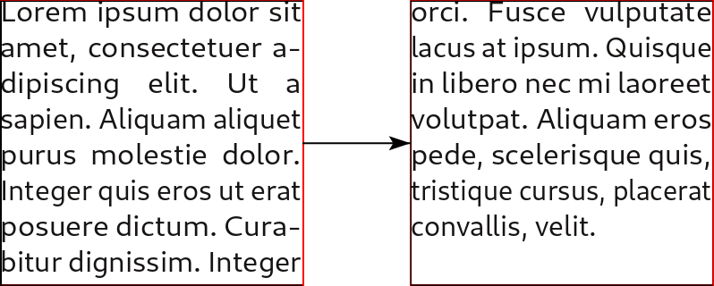

# Linking text frames

When the text is too long and overflows the frame, Scribus displays a small red square at the bottom right.

If you want the text to continue in another frame, you can create a link between frames:

1. Click on the black arrow tool .
2. Click on the frame containing the text.
3. Click on the frame link icon .
4. Create a new text frame.
5. The text flows from one frame to the next.

You can also create a link to an existing frame (on the same page or on the next page) but it is imperative that the second one does not contain any text:

1. Activate the frame containing the text .
2. Click on the frame link icon .
3. Click on the second frame.
5. The text flows from one frame to the next.

To remove the link between frames, use the "unlink" tool  placed just after the link tool and follow the same procedure, but first click on the second frame, then on the first one.

A little hint: to link the frames, you can also click on the overflow mark, without first activating the link tool.

