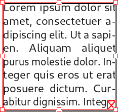

# Lier les cadres de texte

Lorsque le text est trop long et déborde du cadre, Scribus affiche un petit carré rouge en bas à droite.

Si vous souhaitez faire poursuivre le text dans un autre cadre, vous pouvez créer une liaison entre cadres:

1. Cliquez sur l'outil flèche noire .
2. Cliquez sur le cadre contenant le texte.
3. Cliquez sur l'icône de liaison de cadres .
4. Créez un nouveau cadre de texte.
5. Le text coule d'un cadre à l'autre.

Vous pouvez aussi créer une lisaison avec un cadre déjà existant (sur la même page ou sur la page suivante) mais il est alors essentiel que ce deuxième cadre ne contienne aucun texte:

1. Activez le bloc contenant le texte .
2. Cliquez sur l'icône de liaison de bloc .
3. Cliquez sur le deuxième cadre.
4. Le text coule d'un cadre à l'autre.

Pour enlever une liaison, utilisez l'outil de "déliaison"  placé juste après celui de liaison et suivez la même procédure, mais en cliquant d'abord sur le deuxième cadre, puis sur le premier.

Une petite astuce: pour lier les cadre, vous pouvez aussi cliquer sur la marque de débordement, sans activer au prèalable l'outil de liaison.
