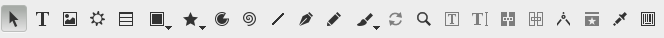

# Les outils

Les outils sont les éléments qui, en général, permettent d'ajouter des choses sur une page. La question est de savoir ce que l'on souhaite ajouter. Voici une liste des principaux outils :

Pour du texte, l'outil _cadre de Texte_ (raccourci T ou )

Pour des images, l'outil _cadre d'image_ (raccourci I ou ).

Pour des formes géométriques, l'outil _polygone_ ou les _formes_ prédéterminées.

A noter que les outils cadres permettent de spécifier une zone dans laquelle un texte sera écrit par la suite ou importé. Lors de l'utilisation des outils, ni texte ni image n'est inséré.

A noter aussi qu'il est impossible d'ajouter une image dans un cadre de texte ou du texte dans un cadre d'image. Si vous vous êtes trompés d'outil, vous pouvez utiliser le menu Objet>Convertir en et choisir cadre de texte ou cadre d'image pour permettre à ce cadre de contenir un autre type d'élément.

Enfin, les polygones ne peuvent contenir ni texte, ni image. Si vous souhaitez placer du texte ou une image dans l'une de ces formes géométrique, vous devrez la convertir comme expliquer ci-dessus. Il s’agit d’un outil plus destiné à la création de formes décoratives ou d'arrières-plans.
