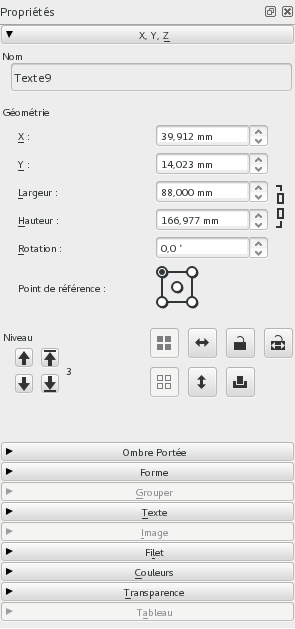
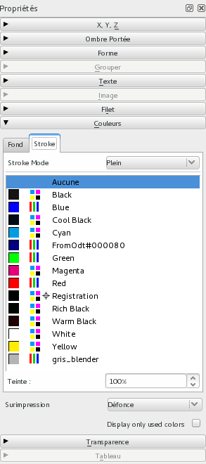
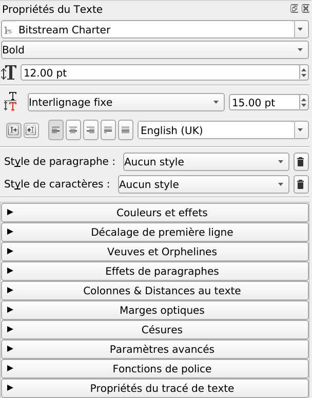

# The windows

Scribus has two main types of windows:

- The modal windows are meant to be used for a short lapse of time and block all interaction with the software until the window is closed. As an example, the window shown by `File > New` is a modal window.
- The permanent windows enable the modification of items, without blocking the access to all other editing options: you don't need to close the window to perform other tasks. The permanent windows can be found in the `Window` menu. `Properties` is one of the most important permanent windows.

The main horizontal toolbar below the menus contains the tools for placing text, images and other items on the page. We will further see them in detail.

Many features can be reached through keyboard shortcuts. Some of the shortcuts are the same you know from other programs: `Ctrl+C` for copying, `Ctrl+S` for saving, or `Ctrl+Z` for undoing. Others are specific to Scribus: as an example  the `T` key activates the tool for creating a text frame.

Of course, you cannot use the `T` shortcut, when you are in edit mode: in that case, Scribus will add the letter `T` to the current text. Using the `Esc` key makes you leave the edit mode and then the `T` key will activate the _Text Frame_ tool.

The _Properties_ window is really at the heart of Scribus. You can find there the key features and you will work with it the most of your time.

The tabs in the _Properties_ window provide most of the settings and the fine tuning for the content.

For the typographic settings, Scribus has a separate window, the _Text Properties_.

