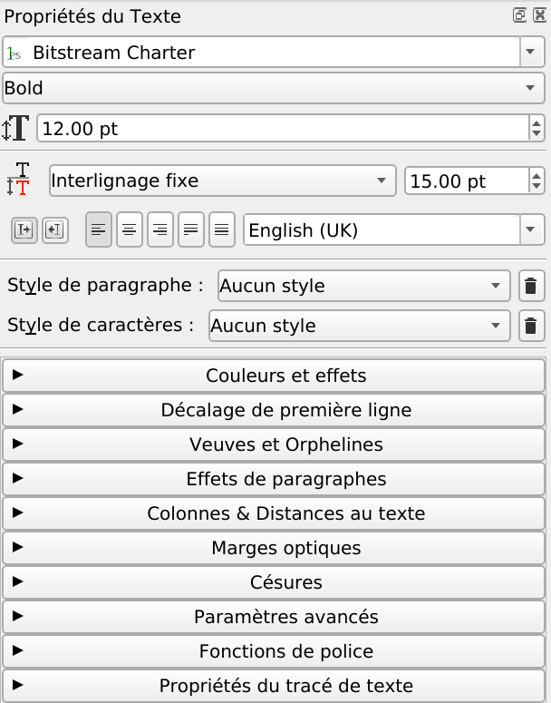

# Les fenêtres

Scribus possèdent deux principaux types de fenêtres :

- Des fenêtres appelées modales qui s'affichent temporairement et bloquent toute autre action dans le logiciel tant que cette fenêtre n'est pas fermée. Par exemple, la fenêtre obtenue en utilisant _Fichier/Nouveau_ est une fenêtre modale.
- Des fenêtres permanentes qui permettent de modifier des éléments, de voir ces éléments s'appliquer même si cette fenêtre n'est pas fermée. Les fenêtres permanentes sont accessibles depuis le menu principal `Fenêtre`. `Propriétés` est une fenêtre permanente essentielle.

Les outils qui permettent de positionner des textes ou des images dans une page sont placés sous le menu, à l'horizontale. Nous allons les voir en détail.

De nombreuses fonctions sont accessibles par des raccourcis clavier.  Ces raccourcis peuvent être commun à d'autres logiciels comme `Ctrl+C` pour copier, `Ctrl+S` pour enregistrer ou `Ctrl+Z` pour annuler ou spécifique à Scribus. Par exemple le simple fait de presser la touche `T`, active l'outil de création de bloc de texte.

Lorsque vous utilisez le raccourci `T`, prenez garde à ne pas être en mode écriture dans un cadre car dans ce cas, Scribus écrira la lettre `T` dans le cadre actif. Le plus sûr est d’appuyer au préalable sur la touche `Échap`.

La fenêtre des `Propriétés` est réellement un des poumons de Scribus.  C’est ici que l’on trouvera les options essentielles et que l’on passera une bonne parties de notre temps.  
On peut d'ores et déjà remarquer qu'elle est divisée en plusieurs parties thématiques. Certaines sont activiées par ce qu'elles sont applicables à notre contexte et d'autres non. La partie actuellement activée  dans l'image ci-contre sert au positionnement des éléments.

Les différents onglets de la fenêtre _Propriétés_ donnent accès à la majorité des réglages sur le contenu.

Pour les réglages typographiques, Scribus a une palette séparée: la palette des _Propriétés de texte_.

