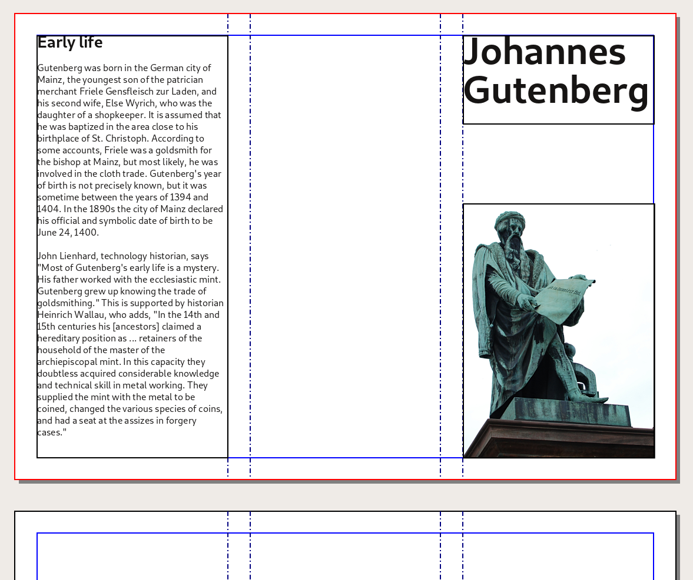
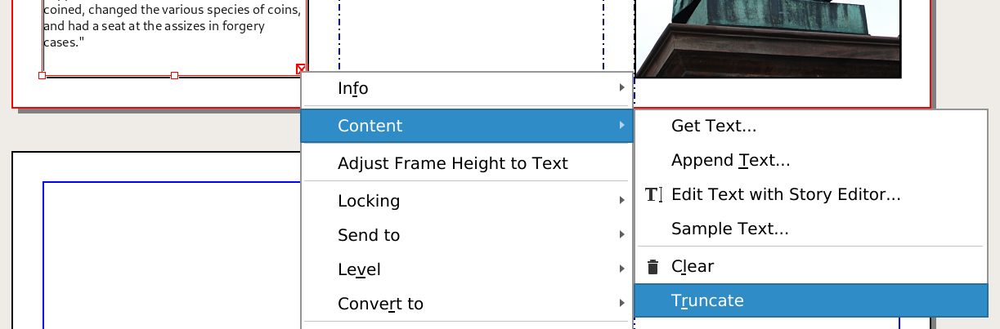

# Write some text

In Scribus, you don't write directly on the page: first you create frames which will then contain the text.

The frames have an exact position and size and are freely placed on the page.

## Draw a frame

Activate the text tool by using the _Insert > Text frame_ menu or the `Insert text frame` icon  next to the arrow  in the toolbar. Draw the text frame on the page by [clicking and dragging](glossary-en.md#clic-and-drag).

You can resize your frame by click-dragging the small red square at the lower right corner: resize it so that it can contain two lines of text: "Johannes Gutenberg".

## Writing

After you have created your frame, Scribus automatically switches back to Item Selection mode  which allows you to select and move items.

Double-click inside the frame to enter the "Edit Contents" mode. The _adjustment_ squares disappear, and you can type in Gutenberg's name.

<table>
<tbody>
<tr>
<td rowspan=2>

</td>
<td>
When you double-click to type into a frame, the handles of the frame disappear.
</td>
<tr>
<td>
The text formatting is done in the main tab of the Text Properties window.
</td>
</tr>
</tbody>
</table>

## Formatting

But your text is quite small isn't it? To change the size select all the text, activate the main tab of _Window > Text Properties_, and play around with the Font Families ❶, Styles ❷ and Sizes ❸.

> While in  _Edit Contents_ mode, you can use the _Edit > Select All_ menu entry to select all text.

If the lines are slightly overlapping, you can increase the Line Spacing ❹. It is usually 20% larger than the font size, but this is no hard rule, especially for titles.

You can exit the _Edit Contents_ mode by clicking on the canvas outside the frame or by pressing the _Esc_ key.
Of course you can get back in the _Edit Contents_ mode by double-clicking inside the frame.

## Getting text from files

For longer texts (or text contributed by other persons) you can copy paste unformatted text from any external source.

To simulate this situation, we use a browser to copy "Early Life" section of the the Wikipedia page about Johannes Gutenberg:  

<https://en.wikipedia.org/wiki/Johannes_Gutenberg#Early_life>

Open the Wikipedia page in your browser, select the content and copy it.

Then, go back to Scribus and create a text frame in the Inside flap – the left column –, resizing it to fill the space between the left margin and the first guide.

Like above, adjust the size of the tile of this text frame.

> The red crossed box  in the lower right corner of the frame reveal that the is too long to fit in the frame. You can delete the overflowing text by right clicking on the frame and choosing _Content > Truncate_.

Scribus also provides filter for importing formatted text from files from few different types of documents (LibreOffice Write, Microsoft Word, HTML, RTF, ...).

More on this in the [Import text] chapter.
